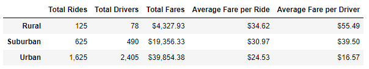

# PyBer_Analysis

# Overview of the Pyber analysis
- The purpose of this analysis is to better understand the ride-sharing data for each city type, this will allow for project planning and assist with business decisions. By performing this analysis it will help us better understand the how each city type is performing with the total number of rides and the average fare as well. We will be analyzing three different city types, urban, rural, and suburban.

# Results
- In the image below you will see the results from our analysis of the Pyber data, showing the different city types, total rides, total drivers, total fare by each city type, average fare per ride and driver. 

- As you can see in the results above Urban city types had a much larger total ride count with 1,625 rides and a larger driver count with 2,405. By a large margin Urban city types also a larger total fares count but due to the larger amount of drivers this caused each driver to make less per ride than both rural and suburban city types. 

- Suburban city types had the second largest total fares with $19,356.33 and six times the amount of total rides and drivers than rural cities. Even with more total rides suburban cities had a lower average fare by per ride than rural cities. Out of the three city types you can see that the average fare per driver for rural cities is the highest with $55.49. 

# Summary
- After performing our analysis of the Pyber Data by city type I have a few recommendations to the CEO to address disparities among the city types. My first recommendations would be to attempt to increase the amount of total drivers for rural cities. With a total of 78 drivers and the natural landscape for rural areas being spreadout drivers are doing longer distance trips and this may cause riders to not be able to find available drivers. Advertising in rural areas will also help to increase the total ride count. I believe that after reviewing the data rural city types should be the main focus because of the large gap of total fares between suburban and urban cities. Another area of concern is the average fare per driver for Urban cities. Out of the three types they have the lowest average and my a large amount as well. The average fare per driver for Urban cities being only $16.57 may cause drivers to be discouraged so I believe that providing them with a incentive our increasing their fare will help bring their average closer to the other city types. 
